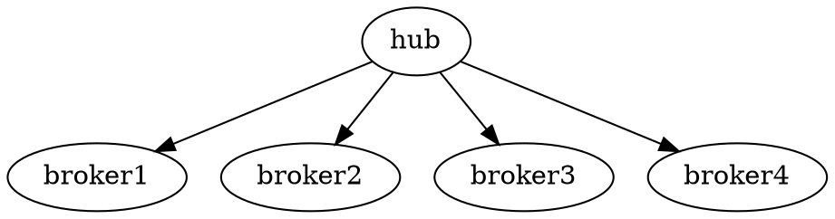

<!-- @import "[TOC]" {cmd="toc" depthFrom=1 depthTo=6 orderedList=false} -->

<!-- code_chunk_output -->

* [1. 概述](#1-概述)
* [2. 设计架构](#2-设计架构)
	* [2.1 微服务设计架构](#21-微服务设计架构)
* [2.2 SSL/TLS时序](#22-ssltls时序)
* [2.3 wireshark](#23-wireshark)
* [3. nginx双向认证配置](#3-nginx双向认证配置)
* [4. 自认证证书生成](#4-自认证证书生成)

<!-- /code_chunk_output -->

使用nginx进行mqtt协议证书双向认证

<!--more-->

### 1. 概述

mqtt认证方式分为三种：

1. general 无鉴权
  通过client ID与云端服务连接

2. user credentials 用户密码鉴权
  通过client ID、Username、Password与云端服务连接

3. SSL/TLS 证书鉴权
  认证的服务器证书
  ca证书
  ca证书密钥
  自认证证书
  自认证证书密钥

目的是实现mqtt自认证证书鉴权

### 2. 设计架构

#### 2.1 微服务设计架构

IoT通过启动nginx服务(hub)对broker进行集束，因此只需要在hub中对证书进行认证就能够实现mqtt协议的证书认证。



* 1883端口:无鉴权和用户密码鉴权
* 8883端口:证书鉴权

### 2.2 SSL/TLS时序

```sequence
client-->server: Client Hello
Note right of server: server will hello
server-->client: Server Hello
server-->client: Certificate
server-->client: Server Key Exchange
server-->client: Certificate Request
server-->client: Server Hello Done
client-->server: Certificate
client-->server: Client Key Exchange
client-->server: Change Cipher Spec
server->server: Certificate Verify
server-->client: Change Cipher Spec
server-->client: Encrypted Handshake Message
Note right of server: finish handshake
server-->client: Change Cipher Spec
server-->client: Encrypted Handshake Message
```

### 2.3 wireshark


### 3. nginx双向认证配置

`parserMqttSslProductID`和`mqtt_ssl_server`为njs函数，用于获取endpoint。

```conf
server {
    listen 8883 ssl;
    js_preread parserMqttSslProductID;
    proxy_pass $mqtt_ssl_server;
    proxy_connect_timeout 1s;
    proxy_timeout 1m;

    ssl_protocols SSLv3 TLSv1 TLSv1.1 TLSv1.2;
    ssl_prefer_server_ciphers On;
    ssl_verify_client on;

    ssl_certificate      /etc/ssl/certs/server.crt;
    ssl_certificate_key  /etc/ssl/certs/server.key;
    ssl_client_certificate  /etc/ssl/certs/ca.crt;

    access_log /var/log/nginx/mqtt_ssl_access.log mqttssl;
    error_log  /var/log/nginx/mqtt_ssl_error.log debug;
}
```

### 4. 自认证证书生成

客户端证书的CN设置为`<devicename>&<productID>`可以用来识别设备和产品。

```shell

PROJECT_NAME="TLS Project"

# Generate the openssl configuration files.
cat > ca_cert.conf << EOF  
[ req ]
distinguished_name     = req_distinguished_name
prompt                 = no

[ req_distinguished_name ]
 O                      = $PROJECT_NAME Dodgy Certificate Authority
EOF

cat > server_cert.conf << EOF  
[ req ]
distinguished_name     = req_distinguished_name
prompt                 = no

[ req_distinguished_name ]
 O                      = $PROJECT_NAME
 CN                     = 192.168.1.140
EOF

cat > client_cert.conf << EOF  
[ req ]
distinguished_name     = req_distinguished_name
prompt                 = no

[ req_distinguished_name ]
 O                      = $PROJECT_NAME Device Certificate
 CN                     = device1&bfuv5ghrgpo6m3c5c0j0
EOF

mkdir ca
mkdir server
mkdir client
mkdir certDER

# private key generation
openssl genrsa -out ca.key 1024
openssl genrsa -out server.key 1024
openssl genrsa -out client.key 1024

# cert requests
openssl req -out ca.req -key ca.key -new \
            -config ./ca_cert.conf
openssl req -out server.req -key server.key -new \
            -config ./server_cert.conf 
openssl req -out client.req -key client.key -new \
            -config ./client_cert.conf 

# generate the actual certs.
openssl x509 -req -in ca.req -out ca.crt \
            -sha1 -days 5000 -signkey ca.key
openssl x509 -req -in server.req -out server.crt \
            -sha1 -CAcreateserial -days 5000 \
            -CA ca.crt -CAkey ca.key
openssl x509 -req -in client.req -out client.crt \
            -sha1 -CAcreateserial -days 5000 \
            -CA ca.crt -CAkey ca.key

openssl x509 -in ca.crt -outform DER -out ca.der
openssl x509 -in server.crt -outform DER -out server.der
openssl x509 -in client.crt -outform DER -out client.der

mv ca.crt ca.key ca/
mv server.crt server.key server/
mv client.crt client.key client/

mv ca.der server.der client.der certDER/

rm *.req
rm *.srl
```